
<\center>

# INTRODUCTION

## Purpose

**SafeStreets** is a crowd-sourced application that intends to provide users with the possibility to notify authorities when traffic violations occur. The main target of the application are violations that can be easily captured by a camera (like, for instance, parking violations). SafeStreets intends also to provide users with the possibility to mine the stored information with different levels of visibility. Moreover, the application must cross the collected data with information coming from the municipality to provide suggestions on possible interventions to decrease the incidence of violations and accidents. In the end, the application must forward data about violations to generate traffic tickets, and must allow authorities to get statistics on issued tickets.

These requirements are exploited by developing several services:

* **SafeReports** allows common users to send violation reports.

* **SafeAnalytics** allows common users and authorities to mine stored information.
* **SafeTickets** allows authorities to get statistics on issued tickets.
* **SafeSuggestions** allows municipality users to get suggestions on possible interventions.

### Goals

The purpose of the software is captured by the following goals:

* **G1**	SafeReports must allow common users to send violation reports.

* **G2**	SafeAnalytics must allow common users to get anonymous data on violations.
* **G3**	SafeAnalytics must allow authorities to access to all the data without restrictions.
* **G4**	SafeSuggestions must allow municipality users to get suggestions on possible interventions.
* **G5**	SafeStreets must generate traffic tickets forwarding reliable data to MTS.
* **G6**	SafeTickets must allow authorities to get statistics on issued tickets.

## Scope

SafeStreets must interface with different types of users and information sources. In this context, it is very important to identify the placement of SafeStreets and its services with the entities of the scenario. To do so, we will refer to the following picture. Afterward, every link between SafeStreets and the entities will be deeply analyzed to exhaustively describe the shared phenomena of the scenario.

 

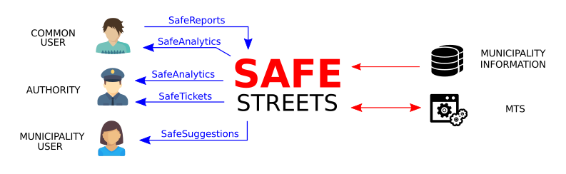

 

Two types of interactions can be defined:

* **Interactions through services** (blue arrows in the diagram)

* **Interactions with resources** (red arrows in the diagram)

The main difference between the two types of interactions is the role of SafeStreets. In the interactions through services, SafeStreets has a passive role, in the sense that the activation of the interaction is triggered by a request coming from the user through one of the offered services. In the interactions with resources, SafeStreets has an active role, in the sense that the activation of the interaction is automatically triggered by SafeStreets application to exploit back-end processes.

Services are exploited differently depending on the type of user that is enjoying the application. The type of the user is determined in the registration phase, which is different depending on this choice. Everyone can sign up as a common user. Instead, to sign up as an authority or municipality user, it is necessary to provide a unique disposable code, which assignment is not part of the application (SafeStreets must take care only of the verification of the provided code). The code is assigned only to users whose role declaration has been manually verified by a human operator. For this reason, the verification of authorities and municipality users is not considered in the registration phase.

### SafeReports

SafeReports is the core of the application. It provides common users with the possibility to send a notification about a violation. To do so, they are asked to take a picture of the vehicle involved in the violation. Then the photo is checked and matched with some data captured at the moment (position, date and time). The user is asked to review and confirm the violation report that, in case of confirmation, is sent to SafeStreets, which stores it to offer several other services.

### SafeAnalytics

SafeAnalytics provides the possibility to mine SafeStreets data to get information about violations. This service is offered to common users and authorities, that can access data with different restriction levels. Common users have access to anonymous data concerning a selected zone. Authorities, instead, have access to unrestricted information on all the stored data.

### SafeTickets

SafeStreets uses Municipality Tickets Service (MTS) to generate traffic tickets. When a new violation is stored (after it is verified not to be a duplicated event), the violation report is forwarded to MTS which generates the traffic tickets and informs SafeStreets of the outcome. SafeStreets stores data about the issued tickets to provide statistics through SafeTickets service.
SafeTickets is a service that allows authorities to access data about tickets generated from SafeStreets using MTS. Authorities are also allowed to select some filters to get statistics and aggregated data.

### SafeSuggestions

Municipality data about accidents is crossed with data collected by SafeStreets to identify possible unsafe areas and provide suggestions through SafeSuggestions service. SafeStreets periodically checks for new data to collect it and keep suggestions up to date.
SafeSuggestions service is developed to municipality users. It allows them to access suggestions on how to reduce the accidents and violations rate in the most critical zones. Users can ask for suggestions using specific filters, depending on their intention to attend in a specific zone or to prevent a specific violation.

### Shared phenomena

| Phenomenon                                                   | Shared | Controller |
| ------------------------------------------------------------ | ------ | ---------- |
| A user wants to notify about a violation                     | No     | World      |
| The user takes a picture using the application               | Yes    | World      |
| The application scans the picture to find a license plate    | No     | Machine    |
| The application does not find a license plate                | No     | Machine    |
| The application asks the user to repeat the procedure        | Yes    | Machine    |
| The application finds a license plate                        | No     | Machine    |
| The application builds a violation report detecting position and timestamp | No     | Machine    |
| The application asks confirmation to the user                | Yes    | Machine    |
| The user confirms the violation report                       | Yes    | World      |
| The application stores the violation report                  | No     | Machine    |
| A user wants information on a violation                      | No     | World      |
| The user selects certain filters                             | Yes    | World      |
| An authority wants information on issued tickets             | No     | World      |
| The authority selects certain filters                        | Yes    | World      |
| The application searches for the requested data              | No     | Machine    |
| The application returns and shows the requested data         | Yes    | Machine    |
| A municipality user wants suggestions                        | No     | World      |
| The municipality user select certain filters                 | Yes    | World      |
| The application searches for the requested suggestions       | No     | Machine    |
| The application returns and shows the requested suggestions  | Yes    | Machine    |
| The application forwards report violations to MTS *          | Yes    | Machine    |
| The application stores data about issued tickets             | No     | Machine    |
| The application requests data about accidents to the municipality * | Yes    | Machine    |
| The application stores data about accidents                  | No     | Machine    |
| The application analyzes data to identify suggestions        | No     | Machine    |

\* MTS and Municipality are considered part of the world, as they are not part of the software to be.

## Definitions and acronyms

| Subject                           | Acronym | Definition                                                   |
| --------------------------------- | ------- | ------------------------------------------------------------ |
| User                              | -       | The consumer of the application. It includes common users, authorities and municipality users. |
| Common user                       | -       | The user type that everyone can sign up as. It does not require any kind of verification. |
| Authority                         | -       | The user type that authorities can get. It requires the verification of an activation code. |
| Municipality user                 | -       | The user type that municipal employees can get. It requires the verification of an activation code. |
| Timestamp                         | -       | A set of information about the time. It includes date (day, month, year) and time (hour, minute, time zone). |
| Violation report                  | -       | The unit of notification collected by SafeStreets. It consists of:<ul><li>The picture of the violation<li>The license plate of the vehicle involved<li>The type of the violation<li>The position of the violation<li>The timestamp of the notification |
| Equivalent events                 | -       | Set of violation reports that satisfy the following conditions:<ul><li>Same vehicles involved<li>Same types of violation<li>Position of the violations are different at most for 10 meters<li>Same dates of the violations |
| Activation code                   | -       | The code to be provided during the registration to get special permits on the account. |
| Municipality Tickets Service      | MTS     | Service offered by the municipality to generate traffic tickets from information about the violations. |
| Optical Character Recognition     | OCR     | Software that converts text scanned from a photo in a machine-encoded text. |
| Query interface                   | -       | The interface provided to the users to select some filters when requesting data. |
| Application Programming Interface | API     | An interface or communication protocol between client and server intended to simplify the building of client-side software. |

## Revision history

| Version | Release date | Description   |
| ------- | ------------ | ------------- |
| 1.0     | 10/11/2019   | First release |

## Document Structure

**Section 1** is an overall introduction to the application. It includes the description of the main functionalities of the application, an analysis of scenarios in which the application works, the list of the potential users of the application with a concise description of the possible interactions and the definition of world-level goals. Also, some meta-information is included, like revision history, references, and explanation of the conventions occurring in the document.

**Section 2** includes the domain assumptions, a detailed description of the shared phenomena and a formal description of the domain carried out using UML class and state diagrams. The purpose of this section is to exhaustively describe the entities and the scenarios that the application must interact with, to be able, in the following sections, to focus only on the application requirements.

**Section 3** includes a detailed description of the application, useful for the development team. Here are classified the interfaces offered by the application, followed by requirements and constraints. More specifically, requirements are listed and matched with the domain assumptions to show how every goal is attained. In this section, the behavior of the application is described with the highest detail level through the use of sequence, activity, and use case diagrams.

**Section 4** includes the formal analysis carried out using Alloy as a modeling language. This section includes the model built focusing on the most critical aspects and the results of the analysis that proves the soundness and consistency of the model. Moreover, some worlds obtained by running the analysis are included to study in deep the most meaningful assertions.

**Section 5** includes information about the number of hours each group member has worked for this document.

**Section 6** includes the references to the tools used to draw up this document.

# OVERALL DESCRIPTION

## Product perspective

The following diagram formally describes the relations between the entities taken into account in the description of the world and of the shared phenomena. More specifically, it provides a clear point of view on which types of users can access the developed services, and shows how SafeStreets interfaces with external resources to exploit back-end processes.

 

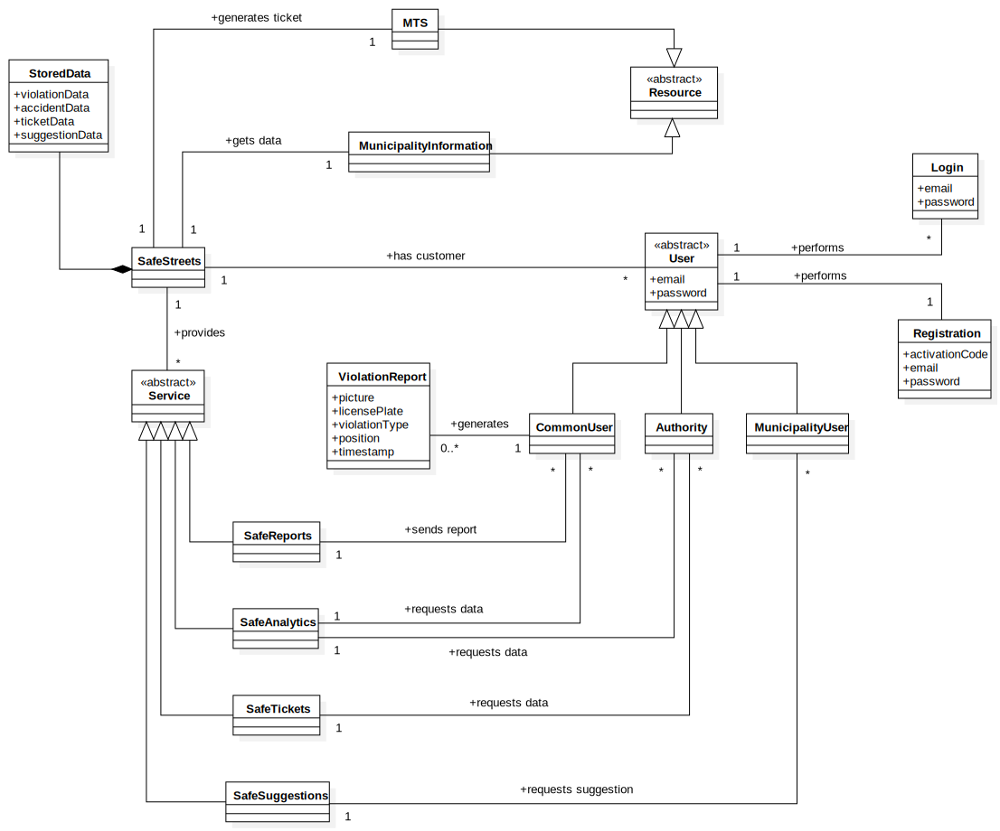

 

As mentioned in the previous section, a service is exploited differently depending on the type of user that is enjoying it. This is important when considering SafeAnalytics, which has a crucial role in the application, but is developed both to common users and authorities. These types of users have different rights when accessing data stored by SafeStreets, and will be provided with different query interfaces to make their requests. If referring to the diagram, one could think to the classes as the processes inherent to specific functionalities, and to the relations as the interfaces provided to the users to enjoy a service.
Relations between application and the resources do not need further explanation, as they are deeply analyzed in the following sections to describe how the interaction works.

### State diagrams

In the diagrams shown below are emphasized the possible states of the entities, and the transitions between one state to another.

**Application**

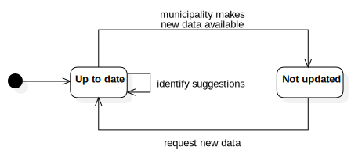

**Common user**

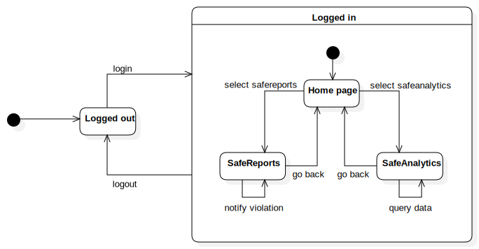

**Authority**

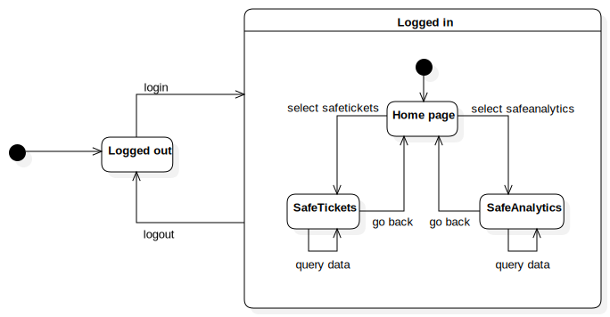

**Municipality user**

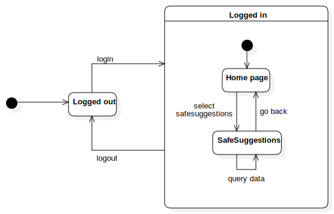

## Product functions

This section focuses on the definition of the functions to be provided to reach the goals previously listed. For each service, a set of requirements is identified. Later on in the document, these requirements will be revised and factored to be mapped on the goals.

### SafeReports

* The service must allow users to take pictures.
* The service must forward pictures to OCR software to detect license plates.
* The service must detect the timestamp.
* The service must detect the position of the user.
* The service must create a violation report filling it with the needed data.
* The service must ask confirmation to the user before sending the violation report.
* The service must check the integrity of the violation report before storing it.
* The service must check for duplicated events before storing the violation report.
* The service must forward stored violation report to MTS.
* The service must store information on issued tickets when forwarding violation reports.

### SafeAnalytics

* The service must provide users with a query interface.
* The service must allow common users to select a time interval in the query interface.
* The service must allow common users to select a day as a minimum granularity of the time interval.
* The service must allow common users to select a zone in the query interface.
* The service must allow common users to select 1 kilometer as the minimum granularity of the zone.
* The service must allow common users to select a violation type in the query interface.
* The service must allow authorities to access a special query interface.
* The service must allow authorities to consult all the information stored.
* The service must allow authorities to select a license plate in the special query interface.
* The service must allow authorities to see the pictures of the violations.
* The service must allow authorities to filter data using any granularity.

### SafeTickets

* The service must provide authorities with a query interface.
* The service must allow authorities to consult all the stored data about issued tickets.
* The service must allow authorities to use the same filters of SafeAnalytics.
* The service must allow going back to the violation report from which the tickets were generated.

### SafeSuggestions

* The service must provide municipality users with a query interface.
* The service must allow municipality users to request a suggestion using the query interface.
* The service must allow municipality users to select a type of violation in the query interface.
* The service must allow municipality users to select a zone in the query interface.
* The service must provide suggestions to reduce the incidence of the selected violation in the selected zone.

## User characteristics

As previously mentioned, several types of users can be identified. Every type of user has different needs and limitations, that must be satisfied providing different services. In this section, users are analyzed with relation to their characteristics, to formally define these needs and limitations.

### Common users

Common users are the core of the application and the channel through which the application collects data. Common users contribute to building the data set that they can query to get data about violations. They must be guided through the process of notification to make it easy and intuitive and must be provided with the possibility to select the correct filters to query the stored data.

### Authorities

Authorities are, from a certain point of view, supervisors of the stored data. They are not provided with the possibility to notify violations (it is not what the authority account was designed for), but they can access all the stored data about both notified violations and issued tickets. For this type of account is not so important the easiness of the interaction. Instead, it is very important to provide authorities with the possibility to use powerful filters to query data.

### Municipality users

The needs of the municipality users are somehow disjoint from those of other users. This type of account is designed to give the possibility to get the suggestions identified by the application. Because of this, municipality users are not provided with the possibility to query the stored data or to notify violations. Instead, they are provided with a special query interface that allows them to select filters depending on which type of intervention they want to put in place.

## Assumptions and dependencies

### Domain assumptions

* **D1**	Users do not modify reality to generate fake violation reports.

* **D2**	The violations notified by the users are coherent with the taken pictures.
* **D3**	There exists a finite set of violations.
* **D4**	There exists a finite number of possible interventions.
* **D5**	Devices running SafeStreets has a working camera.
* **D6**	The camera is always safe (it is not possible to alter the data acquired by the camera).
* **D7**	Devices running SafeStreets are always able to get the timestamp.
* **D8**	Devices running SafeStreets are always able to detect the position with an error of at least 5 meters.
* **D9**	Internet connection is supposed to work whenever a user wants to use SafeStreets.
* **D10**	If OCR software returns a result, it is supposed to be correct.
* **D11**	If OCR software is not able to recognize a plate, it returns a special response.
* **D12**	A violation report is anonymous if and only if it consists only of the type of violation, position, and date.
* **D13**	Authorities and municipality users are previously verified.
* **D14**	Data from the municipality is reliable.

### Dependencies

There are not strong dependencies between the services developed by the application. There is a clear distinction between services that store data and services that access data, thanks to this they can be exploited independently one from each other. It is obvious that accessing the same data set, it is useless to exploit services without storing data, so the utility of the query services is bound to the existence of data collection services.

* SafeAnalytics is based on data collection through SafeReports.

* SafeTickets is based on the data collection from MTS.
* SafeSuggestions is based on the data collection from the municipality data set.

Stronger dependencies exist between SafeStreets and the external services to whom some tasks are delegated.

* SafeReports uses external OCR software.

* SafeStreets is based on the GoogleMaps API.

The characteristic of these dependencies is that the link is not exclusive with the service to which the tasks are delegated, in the sense that services can be changed. OCR software can be any, and OpenStreetMaps API can be used instead of GoogleMaps ones.

# SPECIFIC REQUIREMENTS

## External Interface Requirements

### User Interfaces

The following mockups are made to give an idea of how the user interfaces should look like after the developing process. The mockups represent the core services of SafeStreets focusing on the interaction between the users and the system.

 

*Figure 3.1. The choice between different types of users.*

 

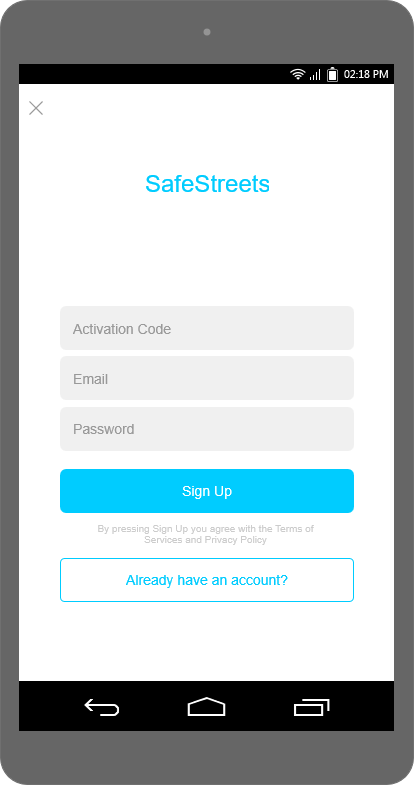

*Figure 3.2. The sign-up process for the municipality user.*

 

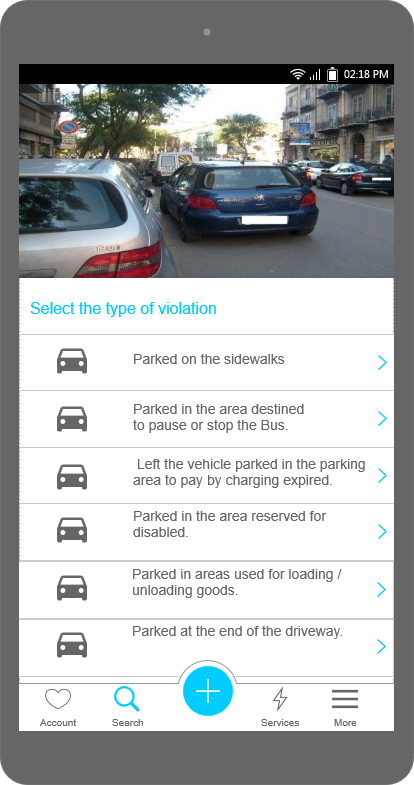

*Figure 3.3. Selection of the type of violation after a user took a picture.*

 

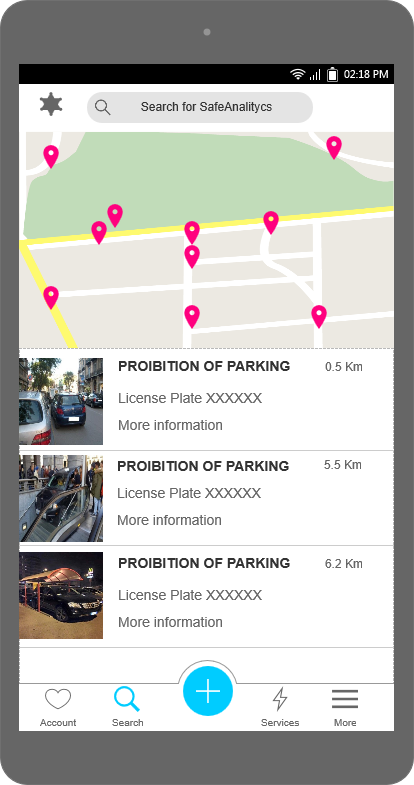

*Figure 3.4. The result of a query for violations made by an authority. Authorities can see all the data stored and can click on a specific violation for more information.*

 

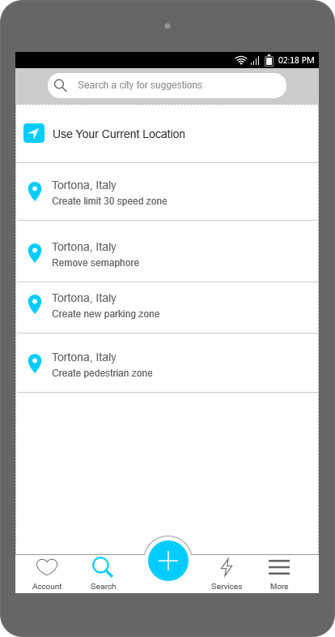

*Figure 3.5. The result of a query using SafeSuggestions. For more information, the user needs to click on the selected suggestion.*

### Hardware Interfaces

The system does not provide any hardware interface.

### Software Interfaces

The system does not provide any software interface.

### Communication Interfaces

The system does not provide any communication interface.

## Functional Requirements

### Scenarios

**Scenario 1**

Ted Mosby, a very honest architect, is tired of seeing cars parked in the red zone right in front of his house. He told the problem to some police agents in the past but nothing happened. He wants to report these violations again but he doesn't know how to do it. Fortunately, Barney, a public employee, suggests him to download and use the new SafeStreets application for reporting violations. After signing up identifying himself as a common user and inserting the email and password he can finally report the violation. Mosby just needs to activate the GPS and the internet connection and take a picture of the violation. He selects the type of violation from a predefined list. After that, he is asked to confirm the plate of the violating vehicle. He finally waits for the outcome of his violation report.

**Scenario 2**

Sheldon, a theoretical physicist, is currently studying the complexity theory. He thinks that in big cities with a huge amount of traffic the number of traffic violations is much larger than in small cities and villages. Since Sheldon moved to Milan recently, he wants to know the areas of Milan with the highest levels of traffic violations to avoid parking in dangerous places. Sheldon knows about the SafeStreets app. He logs in inserting his email and password and makes a query for all the traffic violations reported in the last month in Milan. The results are anonymized preserving the privacy of the violators and then sent back to Sheldon. Sheldon can now park in safe areas.

**Scenario 3**

Chuck, a policeman, was notified about a stolen car. He gets the idea of looking for its possible traffic violations, to find it. He uses SafeAnalytics to retrieve information about it, searching for its license plate. Chuck discovers that the car is often parked on certain reserved parking and finds the car in that location.

**Scenario 4**

Seamus, the police chief, needs to collect the more money he can from traffic tickets, to fund the construction of another police station. Thanks to SafeTickets, he can identify the areas in which more traffic tickets are generated and focus on those areas.

**Scenario 5**

Giovanni, a municipality officer of the city of Milan, is looking for possible interventions in the city, to improve the mobility of his area. Giovanni logs in SafeStreets and accesses SafeSuggestions. He is suggested to build a barrier near the sidewalk in Via Golgi, due to the frequent parking violations that occur there.

### Common users

**Use cases diagram**

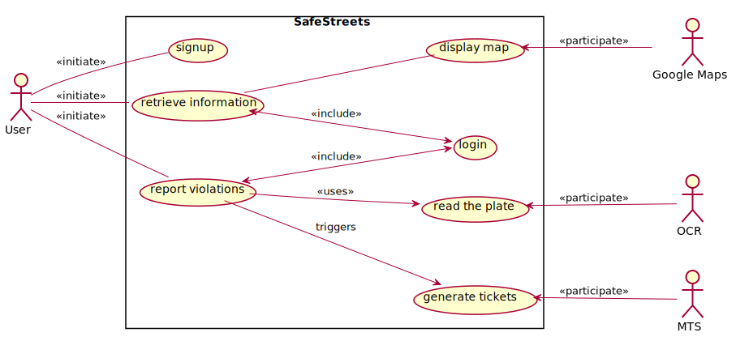

**Use cases**

| Name             | Sign up                                                      |
| ---------------- | ------------------------------------------------------------ |
| Actors           | <ul><li>Common user                                          |
| Entry conditions | <ul><li>The user opens the app on his smartphone             |
| Events flow      | <ul><li>The user clicks on the sign up button<li>The user selects the option to identify himself as a common user<li>The user fills the forms with his email and a password<li>The system confirms his data<li>The system adds the new user to his data |
| Exit conditions  | <ul><li>The users is now registered and his account is registered to the system |
| Exceptions       | <ul><li>The user has already an account. In this case the system suggests the user to click the login button instead or to use another email |

| Name             | Login                                                        |
| ---------------- | ------------------------------------------------------------ |
| Actors           | <ul><li>Common user                                          |
| Entry conditions | <ul><li>The users opens the app on his device<li>The user has already signed up |
| Events flow      | <ul><li>The users presses the login button<li>The users types the email and the password<li>The system confirms the successful login |
| Exit conditions  | <ul><li>The user is logged in and is able to use the SafeStreets services |
| Exceptions       | <ul><li>The user types the wrong email or password. In both cases the system sends and error to the user asking him to try the email password combination again |

| Name             | Report a violation                                           |
| ---------------- | ------------------------------------------------------------ |
| Actors           | <ul><li>Common user<li>OCR                                   |
| Entry conditions | <ul><li>The user has already done the login                  |
| Events flow      | <ul><li>The user takes a picture of the traffic violation<li>The required metadata are automatically added to the picture<li>The user selects the type of violation from a list of violations<li>The picture is sent to the OCR software to automatically scan and read the plate<li>After receiving the plate from the OCR, the system asks the user to confirm the plate of the violation vehicle<li>After the confirmation the system checks if the new violation is equivalent to an already stored one<li>The system checks the integrity of the report<li>The systems stores the violation report if and only if the previous equivalence check returned a negative result and the integrity test was positive |
| Exit conditions  | <ul><li>The user receives a notification about the outcome of its violation |
| Exceptions       | <ul><li>If the OCR is not able to read the plate then the system sends an error to the user and asks him to repeat the procedure |

| Name             | Generate tickets                                             |
| ---------------- | ------------------------------------------------------------ |
| Actors           | <ul><li>SafeStreets<li>MTS                                   |
| Entry conditions | <ul><li>The system has validated and stored a new traffic violation report |
| Events flow      | <ul><li>The system forwards the violation report to MTS<li>MTS generates tickets from the violation report<li>MTS sends the results to SafeStreets |
| Exit conditions  | <ul><li>The system stores data about issued tickets and builds statistics from that data |
| Exceptions       | <ul><li>If MTS is not able to generate the tickets then and error is sent to SafeStreets and no data about issued tickets is stored |

| Name             | Retrieve information                                         |
| ---------------- | ------------------------------------------------------------ |
| Actors           | <ul><li>Common user<li>Google Maps                           |
| Entry conditions | <ul><li>The user has already done the login<li>The user wants to retrieve information about traffic violations |
| Events flow      | <ul><li>The user presses the button to start the query for the desired data<li>The user inserts the geographical filter for the query<li>The user inserts the time filter for the query<li>The system anonymizes the information<li>The results are sent to the user |
| Exit conditions  | <ul><li>The results are displayed in a map exploiting Google Maps' API |
| Exceptions       | -                                                            |

**Sequence diagrams**

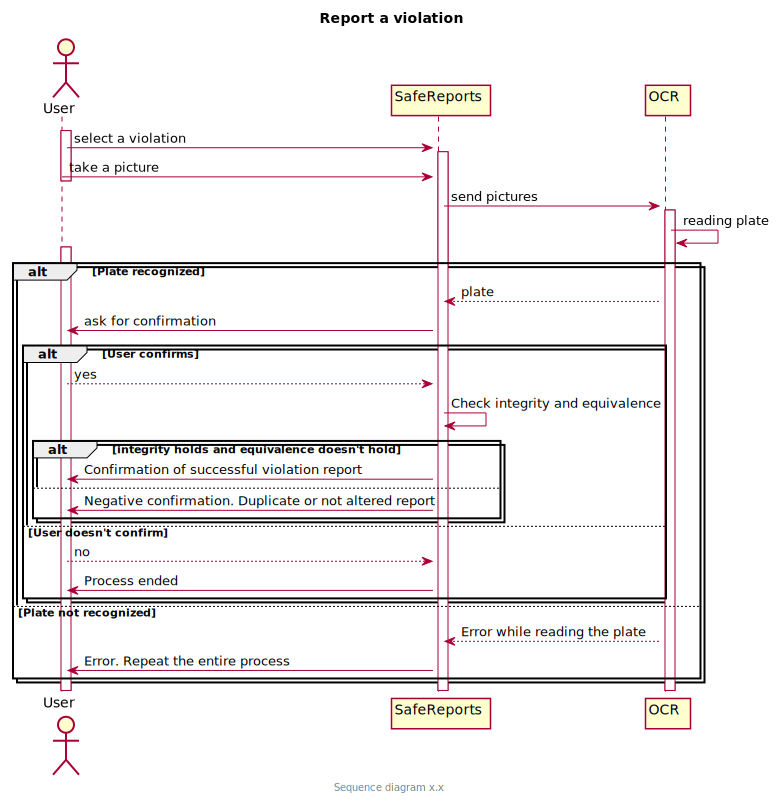

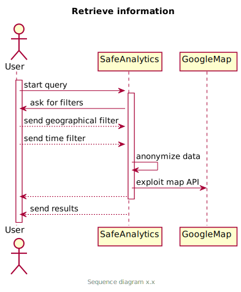

### Authorities

**Use cases diagram**

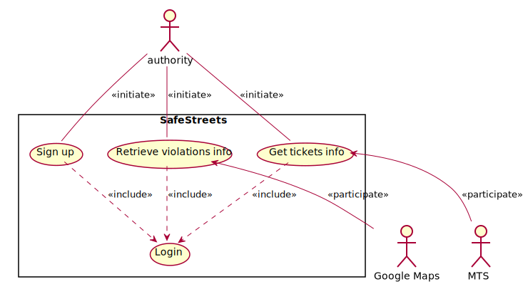

**Use cases**

| Name             | Sign up                                                      |
| ---------------- | ------------------------------------------------------------ |
| Actors           | <ul><li>Authority                                            |
| Entry conditions | <ul><li>The authority opens SafeStreets on his device        |
| Events flow      | <ul><li>The authority chooses the sign up option<li>The authority selects the option to identify himself as authority<li>The authority inserts the activation code<li>The authority inserts his email and password<li>Authority confirms his data<li>SafeStreets saves his data |
| Exit conditions  | <ul><li>The authority is registered and his data are saved   |
| Exceptions       | <ul><li>An account with the same email was already created. In this case SafeStreets warns the authority and asks to change email or log in<li>The activation code is not valid. The authority is asked to reinsert it<li>The authority doesn't provide all the data. In this case the system asks him to insert them |

| Name             | Login                                                        |
| ---------------- | ------------------------------------------------------------ |
| Actors           | <ul><li>Authority                                            |
| Entry conditions | <ul><li>The authority has opened the application on his device<li>The authority is already registered |
| Events flow      | <ul><li>The authority chooses the login option<li>The authority inserts his email and password |
| Exit conditions  | <ul><li>The authority is identified                          |
| Exceptions       | <ul><li>The email is not registered. The authority is asked to reinsert it or sign up<li> The password is incorrect. The authority is asked to reinsert it |

| Name             | Retrieve violation info                                      |
| ---------------- | ------------------------------------------------------------ |
| Actors           | <ul><li>Authority<li>Google Maps                             |
| Entry conditions | <ul><li>The authority is logged in SafeStreets<li>The authority wants to collect data about violations |
| Events flow      | <ul><li>The authority accesses the SafeAnalytics function<li>The authority selects the geographical filters<li>The authority selects the time filters<li>The authority selects the license plate filters<li>Data requested are sent to the authority |
| Exit conditions  | <ul><li>SafeStreets displays the data. If a map is required, it is provided by Google Maps |
| Exceptions       | -                                                            |

| Name             | Get tickets info                                             |
| ---------------- | ------------------------------------------------------------ |
| Actors           | <ul><li>Authority<li>MTS                                     |
| Entry conditions | <ul><li>The authority is logged in SafeStreets<li>The authority wants to get information about tickets issued by SafeStreets |
| Events flow      | <ul><li>Authority accesses the SafeTickets functionality<li>The authority selects the geographical filters<li>The authority selects the time filters<li>The authority selects the license plate filters<li>Data requested are sent by SafeStreets to the authority |
| Exit conditions  | <ul><li>Safestreets displays the data                        |
| Exceptions       | -                                                            |

**Sequence diagrams**

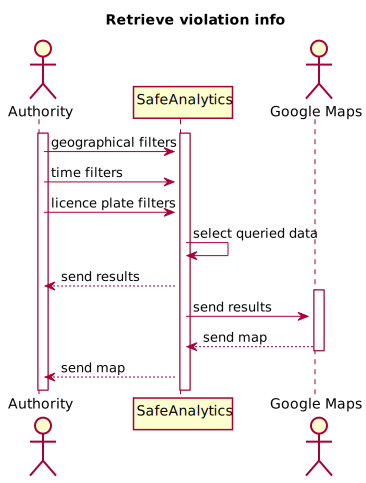

### Municipality users

**Use cases diagram**

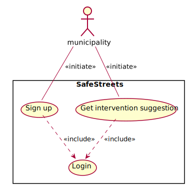

**Use cases**

The use cases "Sign up" and "Login" are equal to the ones of the authorities, and are omitted to avoid redundancies.

| Name             | Get intervention suggestion                                  |
| ---------------- | ------------------------------------------------------------ |
| Actors           | <ul><li>Municipality user                                    |
| Entry conditions | <ul><li>The municipality user has opened the application on his device and logged in<li>The municipality user wants to get suggestions about possible improvements |
| Events flow      | <ul><li>The municipality user accesses the SafeSuggestions functionality<li>The municipality user selects the geographical filters<li>SafeSuggestions gets possible interventions based on the filters provided<li>SafeStreets sends (if available) the suggestion relative to the filters provided |
| Exit conditions  | <ul><li>SafeStreets displays the suggestion (if given) or a "no suggestions" notice |
| Exceptions       | -                                                            |

| Name             | Get accidents suggestion                                     |
| ---------------- | ------------------------------------------------------------ |
| Actors           | <ul><li>Municipality                                         |
| Entry conditions | <ul><li>Timeout trigger is activated                         |
| Events flow      | <ul><li>New data is requested by SafeStreets from the municipality<li>The municipality evaluates if updates in data occurred<li>The municipality provides the new data to SafeStreets<li>Safestreets updates its data and builds new statistics in order to generate new suggestions |
| Exit conditions  | <ul><li>The new suggestions are stored in the system         |
| Exceptions       | -                                                            |

**Sequence diagrams**

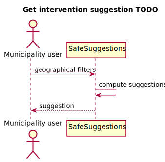

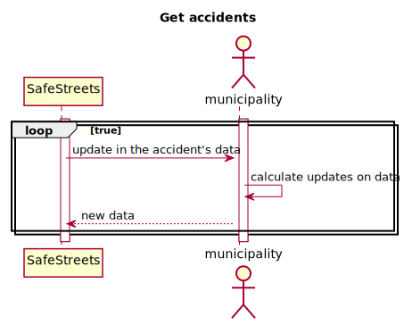

### Activities

The following activity diagram shows the activity flow of the registration process.

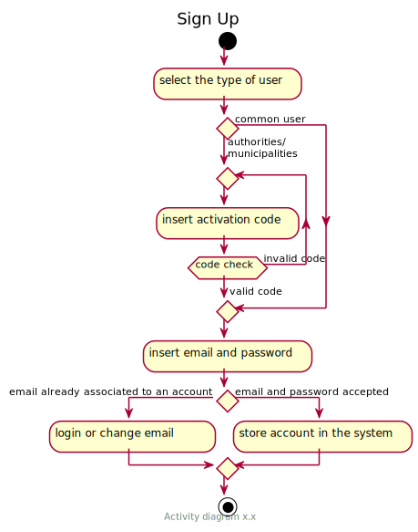

The following activity diagram shows the activity flow of the generation of new suggestions from the application.

### Requirements

**G1)  SafeReports must allow common users to send violation reports.**
* **R1**	When a picture is taken using SafeReports, a new violation record is generated.

* **R2**	When a new violation record is generated, the current position of the user is added to the report.
* **R3**	When a new violation record is generated, the timestamp is added to the report.
* **R4**	When a new violation record is generated, the photo is scanned by an OCR software to automatically detect the plate.
* **R5**	If the OCR software fails in detecting the plate, the user is notified and asked to repeat the procedure.
* **R6**	If the OCR software detects the plate, the user is asked to confirm the violation report.
* **R7**	If the user confirms the violation report, it is sent to SafeStreets.
* **R8**	SafeStreets stores the information about the violation only if there aren't equivalent events already stored.

**G2) SafeAnalytics must allow common users to get anonymous data on violations.**
* **R9**	SafeAnalytics allows common users to get data about violations selecting zone, time and type of violation.

* **R10**	SafeAnalytics anonymizes information before sending it to common users.

**G3) SafeAnalytics must allow authorities to access to all the data without restrictions.**
* **R11**	SafeAnalytics allows authorities to get all the data stored by SafeStreets.

**G4) SafeSuggestions must allow municipality users to get suggestions on possible interventions.**
* **R12**	SafeStreets must store data about accidents provided by the municipality when available.

* **R13**	SafeStreets must analyze collected data crossed with data from the municipality to identify possible interventions.
* **R14**  SafeSuggestions allows municipality users to get suggestions provided by SafeStreets.

**G5) SafeStreets must generate traffic tickets forwarding reliable data to MTS.**
* **R15**	When the users send a violation report, its integrity is checked.

* **R16**	If the integrity check is not successful, the violation report is discarded.
* **R17**	SafeStreets must forward every new stored violation report to MTS to generate traffic tickets.

**G6) SafeTickets must allow authorities to get statistics on issued tickets.**
* **R18**	When a new ticket is generated using MTS, ticket-related data are stored by SafeStreets.

* **R19**	SafeStreets must build statistics from stored data about issued tickets.
* **R20**	SafeTickets allows authorities to get information and statistics on issued tickets.

### Traceability matrix

| Requirements | Goal | Use case                    |
| :----------- | :--- | :-------------------------- |
| R1           | G1   | Report violations           |
| R2           | G1   | Report violations           |
| R3           | G1   | Report violations           |
| R4           | G1   | Report violations           |
| R5           | G1   | Report violations           |
| R6           | G1   | Report violations           |
| R7           | G1   | Report violations           |
| R8           | G1   | Report violations           |
| R9           | G2   | Retrieve information        |
| R10          | G2   | Retrieve information        |
| R11          | G3   | Retrieve violations info    |
| R12          | G4   | Get accidents               |
| R13          | G4   | Get accidents               |
| R14          | G4   | Get intervention suggestion |
| R15          | G5   | Generate tickets            |
| R16          | G5   | Generate tickets            |
| R17          | G5   | Generate tickets            |
| R18          | G6   | Generate tickets            |
| R19          | G6   | Generate tickets            |
| R20          | G6   | Get tickets info            |

## Performance Requirements

* The system must be able to serve a great number of users reporting a violation simultaneously.

* SafeAnalytics must be able to provide the data requested by both common users and authorities in less than 3 seconds, to provide the best experience.
* The data about accidents provided by the municipality must be checked for updates at least every 5 minutes, to provide reliable and always updated suggestions.

## Design Constraints

### Standards compliance

The timestamp must adopt the ISO 8601 standard. The chain of custody of the information coming from the user must never be broken, so the correspondence of the data provided by a common user and the one received by MTS must be guaranteed.

### Hardware limitations

To correctly run the application, the device must have a camera with a resolution sufficient to provide an understandable image, a working internet connection, and a GPS.

### Any other constraint

The system must not provide sensitive data to common users, so the license plate and the photo of a violation must not be provided to them.

## Software System Attributes

### Reliability

SafeStreets must be fault-tolerant, so data must not be lost. This can be achieved by keeping multiple copies of the data.

### Availability

SafeStreets must be working 24/7.
SafeReports is expected to work with an availability of 99.999%, as it is the core of the application. The other functionalities can be slightly less fault-tolerant, and be available 99.99% of the time.

### Security

The data provided by common users contain sensitive information, so security is a crucial point. The databases on which data is collected must be protected to avoid attacks, and the software must be GDPR compliant. Data must be encrypted when sent, and the reliability of the data received by MTS must be checked.

### Maintainability

The code must be easy to fix and modify, to reduce the effort and the cost of the modifications. It must avoid fast obsolescence, so be always as aligned as possible to the new stable technologies.
The modularity of the code and the reusability of the logic (which needs to be as separated as possible from the implementation) are needed to guarantee the ease of maintenance in the future.

### Portability

The software is thought to run on the majority of mobile devices, so it should be developed for Android and iOS smartphones.

# FORMAL ANALYSIS USING ALLOY

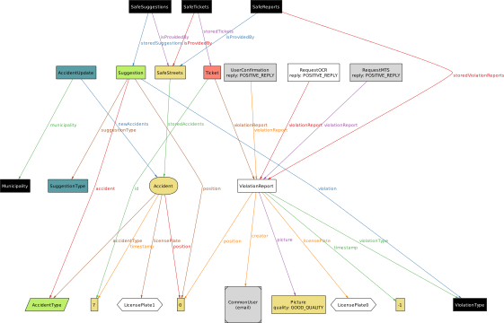

 

 

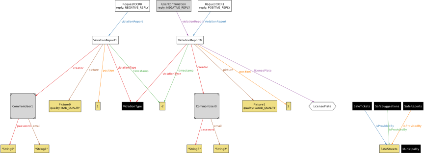

# EFFORT SPENT

| Task                            | Braga | Calderon | Favaro |
| ------------------------------- | :---: | :------: | :----: |
| Introduction                    |  11   |    11    |   11   |
| Product perspective             |   3   |    3     |   3    |
| Product functions               |   2   |    2     |   2    |
| User characteristics            |   2   |    2     |   2    |
| Assumptions and dependencies    |   4   |    4     |   4    |
| External Interface Requirements |   3   |    3     |   3    |
| Functional Requirements         |  12   |    12    |   12   |
| Performance Requirements        |   1   |    1     |   1    |
| Design Constraints              |   1   |    1     |   1    |
| Software System Attributes      |   1   |    1     |   1    |
| Formal Analysis using Alloy     |  17   |    17    |   17   |

# REFERENCES

* Specification document "Mandatory Project Assignment" 2019-2020

* IEEE Std 830-­1998 IEEE Recommended Practice for Software Requirements Specifications
* UML diagrams:
<https://www.uml-diagrams.org/>
* Alloy:
<http://alloytools.org/>
